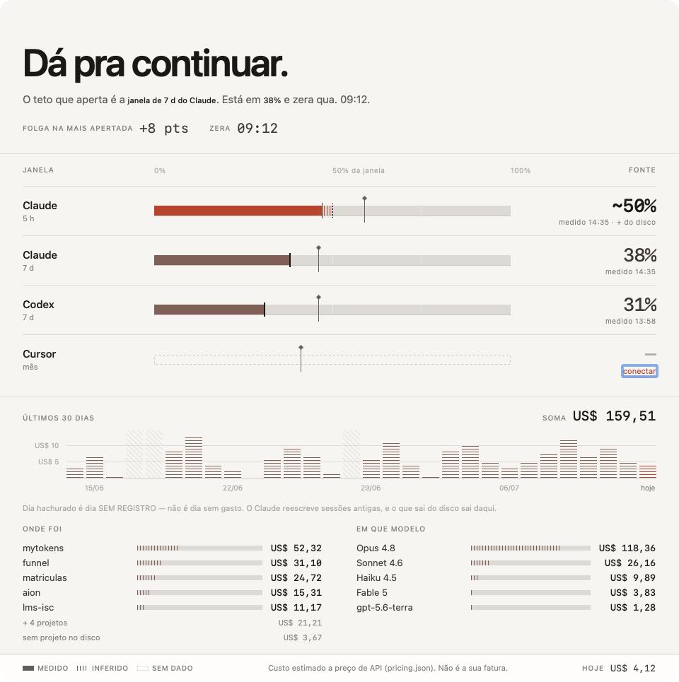
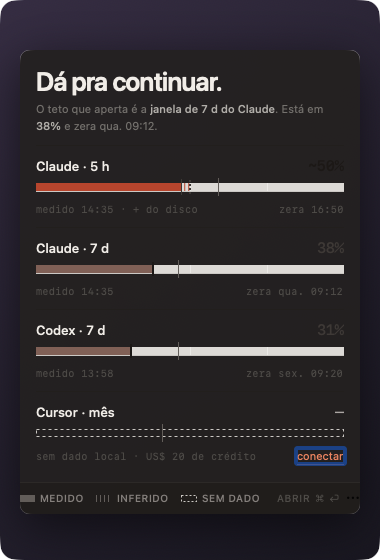

# MyTokens

[](https://github.com/jairrebello/mytokens/actions/workflows/ci.yml)

App de barra de menu pra macOS que responde uma pergunta só, numa olhada: **posso continuar trabalhando ou vou bater no limite?**

Ele lê o disco local de Claude Code, Codex e Cursor — nada sai da máquina — e mostra o que cada ferramenta realmente expõe. Não mais que isso, e não menos.

<p align="center">
  <picture>
    <source media="(prefers-color-scheme: dark)" srcset="docs/img/window-dark.png">
    
  </picture>
</p>

## O que ele mostra — e por que não é tudo igual

As três ferramentas não entregam o mesmo dado, e fingir que entregam seria a mentira mais fácil de cometer aqui.

- **Codex** publica `% usado + reset`. É **medido** — vem da própria ferramenta.
- **Claude** só publica gasto. O que resta da janela é **derivado**: um cálculo em cima do gasto, não um número que o Claude te deu.
- **Cursor** não publica nada sem API própria configurada. Sem isso, a pista dele é **ausência** — não um zero.

Medido, derivado e ausente têm desenhos diferentes na tela: pista sólida, hachura reticulada, e o vazio que não finge ser zero. Três leituras honestas, uma linguagem visual só — não um card de SaaS repetido três vezes.

## Features

**Bancada** — uma pista por janela de limite (5h do Claude, semana do Codex, o que o Cursor tiver), lado a lado, na mesma régua.

**Trilho dos 30 dias** — o histórico de gasto, dia a dia. Clique numa coluna e as duas listas abaixo (**ONDE FOI** / **EM QUE MODELO**) recortam pra aquele dia específico, com um sub-rótulo avisando a troca de escopo (`ONDE FOI · ter. 14/07`). Clique de novo, ou fora das barras, e volta pro período inteiro.

**Orçamento** — teto que você escreve, medido com a mesma régua do resto do app. Não é limite da ferramenta: é o seu.

**Statusline** — o mesmo instrumento no terminal, via `scripts/statusline-install.sh`.

**Abrir no login, dark mode, VoiceOver honesto** — o app fala em voz alta a mesma distinção que desenha: "estimado" continua estimado quando lido por leitor de tela, não vira um número seco.

<p align="center">
  <picture>
    <source media="(prefers-color-scheme: dark)" srcset="docs/img/popover-dark.png">
    
  </picture>
</p>

## A filosofia, em quatro frases

- O disco do Claude é **mutável** — sessão antiga é reescrita, compactada, some. O passado se reescreve sozinho.
- Hachura reticulada é a marca de **inferido**: preço de tabela sobre tokens, não fatura.
- Um dia com registro e gasto zero é um **fato** — a coluna não sobe, e está certo não subir.
- Um dia **sem** registro não é um dia sem gasto. É um dia sem prova. Os dois não podem ter o mesmo pixel.

## Instalação

Build local, ad-hoc — funciona nesta máquina, sem depender de assinatura de terceiro:

```bash
git clone https://github.com/jairrebello/mytokens.git
cd mytokens
./scripts/install.sh
```

## Download

Quem preferir não buildar: [github.com/jairrebello/mytokens/releases/latest](https://github.com/jairrebello/mytokens/releases/latest).

O DMG é **assinado com Developer ID e notarizado pela Apple** — baixou, arrastou pra `/Applications`, abriu. O sha256 de cada artefato está nas notas da release, pra quem quiser conferir o que baixou.

## Requisitos

- macOS 14+
- Xcode, se for buildar da fonte

## Arquitetura

Três peças, separação limpa entre medir e mostrar:

- **MyTokensCore** — Swift puro. Lê o disco, agrega eventos, calcula janelas de limite. Zero UI, zero SwiftUI.
- **MyTokensUI** — os componentes visuais (pistas, trilho, listas de corte), como package independente — testável e navegável fora do app.
- **App** — o shell de menu bar: `AppModel`, watcher de FSEvents, ícone de status, o hook de statusline.
